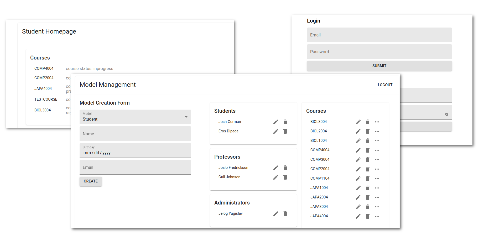

# COMP4004 Final Project


## Table of Contents
- [About the Repo](#about-the-repo)
- [Getting Started](#getting-started)
- [Running the Tests](#running-the-tests)
- [Code Structure](#code-structure)
- [Tech](#tech)
- [Deployment](#deployment)
- [Contributors](#contributors)
- [License](#license)


## About the Repo
This repo shows the development state of the final project for COMP4004.

Despite being available on github, this repository is intended as a read-only resource and has been licensed as such. Permissions are not given to use or modify this software.

## Getting Started
Running this code requires some dependencies:
- [Docker](https://www.docker.com/)
- [NPM](https://nodejs.org/en/)
- [Make](http://gnuwin32.sourceforge.net/packages/make.htm)

This code's development environment was setup using linux and was not developed with windows support in mind, although not tested it is also likely functional in MacOS. If you are required to run this repository, it is *highly* recommended you do it with a linux distribution and or virtual machine.

_If you are running docker using windows you may find unexpected errors_

#### Install steps

After cloning the repo to your local machine enter the root directory and run `make install`.

Having completed this, in the root directory run `make up`.

This runs the app in the development mode.<br>
Open [http://localhost:3000](http://localhost:3000) to view it in the browser.

The page will reload if you make edits.<br>
You will also see any lint errors in the console.

## Running the tests
Tests in this repository can be found in three forms:
1. backend tests
2. frontend tests
3. acceptance tests

And can be run in the following ways:

### Manual Testing
Manual testing for ensuring feature compatibility can be done by starting the app as normal with `make up` and logging into one of the available accounts.

#### Credentials
Administrator: jelog@gmail.com
Student: josh@gmail.com
Professor: joslo@gmail.com

All accounts on this application make use of the password _supersecret_

As this is not a production version of the application, all new accounts are also created with the password _supersecret_, to test new accounts simply use given e-mail plus this password.

Functionality is built to allow for various passwords however for testing purposes it was left in this state.

### Frontend
Enter the `frontend/` directory and run the command `npm run test`
  
### Backend
Start the project by running  a shell in the root directory of the project and running `make up`

Once the project is running, open a new shell, enter the `backend/` directory and run the command `npm run testLocal`

### Acceptance tests
*Feature files can  be found in the directory `backend/features`*

*This code is ran using `selenium` and as such, the test suite requires a viewable browser window. While running the test suite ensure adequate space on your monitor for selenium to interact.*

Start the project by running  a shell in the root directory of the project and running `make up`

Once the project is running, open a new shell, enter the `backend/` directory and run the command `npm run bdd`
 
## Code Structure
Explained here are the most important points of the code structure, where to find configs, etc.
```
.
├── backend
|   ├── config
|   ├── features
│   |   ├── bddTest
│   |   |   ├── share-objects
│   |   |   ├── step-definitions
│   |   └── ...
|   ├── public
|   ├── scripts
|   ├── src
│   |   ├── db
│   |   ├── middleware
│   |   ├── services
│   |   ├── utils
│   |   ├── app.js
│   |   ├── authentication.js
│   |   └── ...
|   ├── test
|   ├── .editorconfig
|   ├── .eslintrc.json
|   ├── .gitignore
|   ├── .sequelizerc
|   ├── Dockerfile 
|   ├── package.json 
|   ├── selenium-cucumber-js.json 
|   ├── yarn.lock 
│   └── ...
├── frontend
|   ├── public
|   ├── src
│   |   ├── Components
│   |   ├── Pages
│   |   ├── Server
│   |   ├── Utils
│   |   ├── App.jsx
│   |   ├── AppRouter.jsx
│   |   └── ...
|   ├── .eslintrc.js
|   ├── .gitignore
|   ├── Dockerfile
|   ├── jsconfig.json
|   ├── package.json
|   ├── yarn.lock
│   └── ...
├── .gitignore              # Files that should not be posted to git (ex. npm modules)
├── Makefile                # Project build management commands
├── docker-compose.yml      # Container runner and configurations
└── ...
```

## Tech
Frontend: 
- [React](https://reactjs.org/)
- [Material-ui](https://material-ui.com/)
- [SCSS](https://sass-lang.com/)
- [Feathers.js](https://expressjs.com/)

Backend:
- [Node](https://nodejs.org/en/)
- [Express](https://expressjs.com/)
- [Feathers.js](https://expressjs.com/)
- [Sequelize](https://sequelize.org/)

Database:
- [PostgreSQL](https://www.postgresql.org/)

DevOps:
- [Docker-compose](https://docs.docker.com/compose/)

Testing:
- [Jest](https://jestjs.io/)
- [Enzyme](https://enzymejs.github.io/enzyme/)
- [Selenium](https://www.selenium.dev/)
- [Cucumber](https://cucumber.io/)

Linting and Formatting: 
- [Airbnb style guide](https://airbnb.io/javascript/react/)
- [Eslint](https://eslint.org/)
- [Prettier](https://prettier.io/)

## Deployment
This website is currently not deployed.

## Contributors
- Eros Di Pede
  + [Github](https://github.com/ForkBombGIT)
  + [Website](https://erosdipede.me/)
- Josh Gorman
  + [Github](https://github.com/Liannus)
  + [Website](https://joshgorman.ca/)
  
## License
As this code is currently unlicensed, no permissions are given to use or modify this software.
